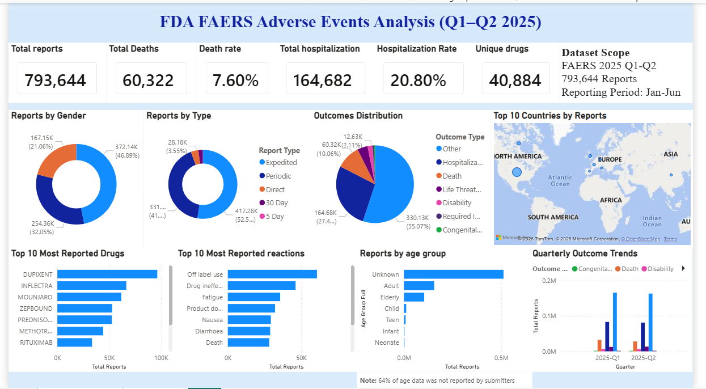
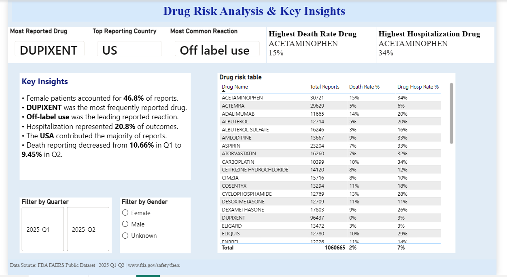

# 💊 FDA FAERS Adverse Events Analysis (Q1–Q2 2025)


An end-to-end data analytics project analyzing **793,644 FDA Adverse Event Reports (FAERS)** from Q1–Q2 2025, identifying drug safety signals, reporting patterns, and demographic trends using Excel, MySQL, and Power BI.

---

## 📌 Project Overview

Analysis of FDA Adverse Event Reporting System (FAERS) data for Q1 and Q2 2025, covering 793,644 adverse event reports across multiple dimensions including drugs, reactions, outcomes, and patient demographics.

---

## 🎯 Business Objective

To analyze FDA FAERS adverse event reports and identify reporting patterns, serious outcomes, demographic trends, and potential drug safety signals using data analytics and visualization techniques.

---

## 🛠️ Tools & Technologies

| Tool | Purpose |
|------|---------|
| **Microsoft Excel** | Data cleaning and preprocessing |
| **MySQL Workbench** | Database creation, data import & cleaning |
| **Power BI Desktop** | Interactive dashboard development & visualization |
| **DAX** | KPI calculations and analytical measures |
| **GitHub** | Version control & portfolio documentation |

---

## 📊 Dataset Information

| Attribute | Details |
|-----------|---------|
| **Source** | FDA FAERS Public Dataset |
| **Period** | January – June 2025 (Q1 & Q2) |
| **Tables Used** | DEMO, DRUG, REAC, OUTCOMES |
| **Total Records** | 793,644 adverse event reports |

---

## 📂 Project Structure

```text
FDA-FAERS-Adverse-Events-Analysis/
├── 2025 Q1/                         — Raw data files Q1
├── 2025 Q2/                         — Raw data files Q2
├── SQL/
│   ├── 01_create_and_import.sql
│   ├── 02_cleaning.sql
│   └── 03_analysis.sql
├── dashboard.png
├── insight.png
└── FAERS_Analysis_PowerBI.pdf
```

---

## 🖼️ Dashboard Preview

### Main Dashboard


### Drug Risk Analysis & Key Insights


---

## 🔍 Key Metrics

| Metric | Value |
|--------|-------|
| Total Reports | 793,644 |
| Total Deaths | 60,322 |
| Death Rate | 7.60% |
| Total Hospitalizations | 164,682 |
| Hospitalization Rate | 20.80% |
| Unique Drugs | 40,884 |

---

## 📈 Key Findings

- **DUPIXENT** was the most frequently reported drug (96,437 reports)
- **Off-label use** was the leading reported reaction
- Female patients accounted for **46.8%** of reports
- Death rate was **7.60%** and Hospitalization rate was **20.80%**
- **USA** contributed the majority of FAERS reports (**66%**)
- Death reporting decreased from **10.66% in Q1** to **9.45% in Q2**
- **ACETAMINOPHEN** had the highest death rate (**15%**) among major drugs

---

## 💡 Skills Demonstrated

- Data Cleaning & Preprocessing
- SQL Database Design & Querying
- Exploratory Data Analysis (EDA)
- DAX Measures & KPI Development
- Dashboard Design
- Pharmacovigilance / Drug Safety Analysis
- Data Visualization
- Business Storytelling

---

## ⚠️ Limitations

FAERS is a spontaneous reporting system and is primarily used for signal detection. Report counts do not represent incidence rates and cannot establish causality between a drug and an adverse event.

---

## 📚 Data Source

FDA FAERS Public Dataset — [https://www.fda.gov/safety/faers](https://www.fda.gov/safety/faers)

---

## 👩‍💻 Author

**Priyanka J**

📧 Email: **21priyankaj@gmail.com**

💼 LinkedIn: **https://linkedin.com/in/priyanka-jadhav-73a37a282**

🐙 GitHub: **https://github.com/Thepriyankaj**

---

## 📄 License

This project is intended for **portfolio and educational purposes only**.

Dataset Source: **FDA FAERS Public Dataset**

---

⭐ **If you found this project helpful, please consider giving it a Star!**
